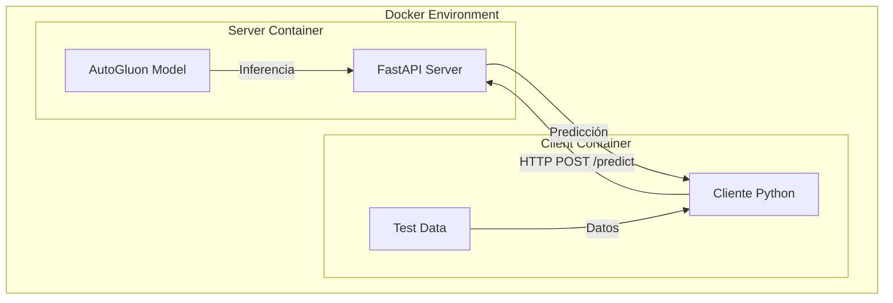
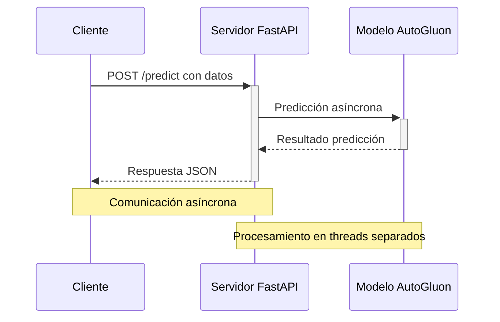

# Proyecto de Predicción con FastAPI y AutoGluon

## Descripción General

Este proyecto implementa un sistema de predicción distribuido utilizando FastAPI y AutoGluon, desplegado en contenedores Docker. El sistema consiste en un servidor que expone un modelo de predicción a través de una API REST y un cliente que realiza peticiones asíncronas para obtener predicciones.

### Tecnologías Principales
- FastAPI: Framework web moderno y rápido para crear APIs con Python
- AutoGluon: Framework de AutoML para entrenamiento y predicción de modelos
- Docker: Plataforma de contenedores para el despliegue
- aiohttp: Cliente HTTP asíncrono para Python
- Pandas: Manipulación y análisis de datos

## Arquitectura del Sistema



## Diagrama de Flujo de Datos



## Requisitos

- Docker Engine 24.0+
- Docker Compose 3.12.9+
- Python 3.x (para desarrollo local)
- Suficiente espacio en disco para los contenedores y el modelo

## Estructura del Proyecto

```
.
├── servidor.py          # Servidor FastAPI con el endpoint de predicción
├── cliente.py          # Cliente asíncrono para realizar peticiones
├── Dockerfile.server   # Dockerfile para el contenedor del servidor
├── Dockerfile.client   # Dockerfile para el contenedor del cliente
├── docker-compose.yaml # Configuración de servicios Docker
├── data/              # Directorio con datos de prueba
├── runs/              # Directorio con el modelo entrenado
├── poetry.lock        # Lock file de dependencias
└── pyproject.toml     # Configuración del proyecto y dependencias
```

## Instalación y Configuración

1. Clonar el repositorio:
```bash
git clone [URL del repositorio]
cd [nombre-del-proyecto]
```

2. Construir y ejecutar los contenedores:
```bash
docker-compose up --build
```

## Uso

### Iniciar el Sistema

El sistema se inicia automáticamente al ejecutar docker-compose:
- El servidor FastAPI se ejecutará en el puerto 5000
- El cliente comenzará a enviar peticiones de prueba automáticamente

### API Endpoints

#### POST /predict
Realiza una predicción basada en los datos proporcionados.

Ejemplo de payload:
```json
{
    "state": "SP",
    "city": "Sao Paulo",
    "local_pickup": true,
    "free_shipping": false,
    "shipping_mode": "standard",
    "listing_type": "gold_special",
    "buying_mode": "buy_it_now",
    "status": "active",
    "accepts_mercadopago": true,
    "currency": "BRL",
    "automatic_relist": false,
    "stock_quantity": 10,
    "available_quantity": 5,
    "total_amount": 100.0,
    "date_difference_hr": 24.0,
    "time_difference_hr": 12.0
}
```

## Detalles Técnicos

### Servidor FastAPI

- Implementa un endpoint POST `/predict` para predicciones
- Utiliza procesamiento asíncrono para manejar múltiples peticiones
- Carga el modelo AutoGluon al iniciar
- Ejecuta las predicciones en threads separados para no bloquear el event loop

### Cliente

- Realiza peticiones asíncronas utilizando aiohttp
- Implementa retrasos aleatorios entre peticiones
- Maneja timeouts y errores de conexión
- Lee datos de prueba desde archivos parquet

### Sistema de Contenedores

- Servidor y cliente en contenedores separados
- Red Docker compartida para comunicación entre servicios
- Variables de entorno para configuración flexible
- Dependencias gestionadas con Poetry

## Desarrollo y Pruebas

### Desarrollo Local

1. Instalar dependencias:
```bash
poetry install
```

2. Ejecutar el servidor:
```bash
poetry run python servidor.py
```

3. En otra terminal, ejecutar el cliente:
```bash
poetry run python cliente.py
```

### Consideraciones de Prueba

- Utilizar el cliente incluido para pruebas de carga
- Monitorear los logs del servidor para errores
- Verificar el uso de memoria del contenedor del modelo

## Consideraciones de Rendimiento

- El servidor utiliza procesamiento asíncrono para manejar múltiples peticiones
- Las predicciones se ejecutan en threads separados para no bloquear
- El cliente implementa retrasos aleatorios para evitar sobrecarga
- Los contenedores pueden escalarse según necesidad

## Mantenimiento

- Monitorear el uso de recursos de los contenedores
- Actualizar las dependencias regularmente
- Hacer backup del modelo entrenado
- Revisar los logs del servidor para detectar errores